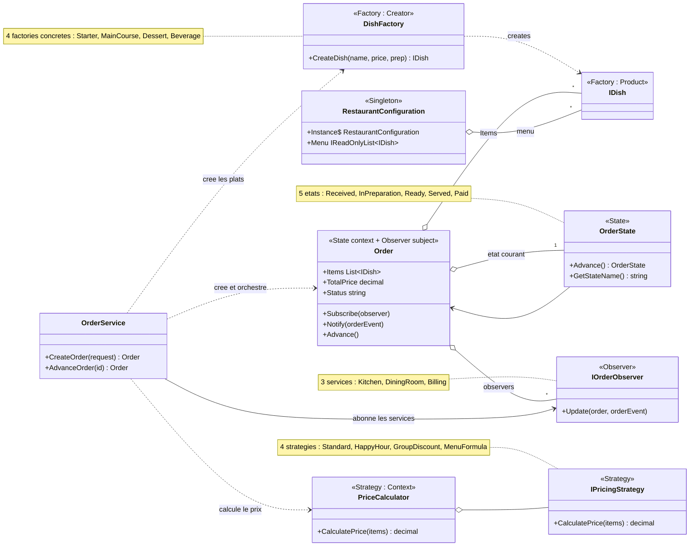
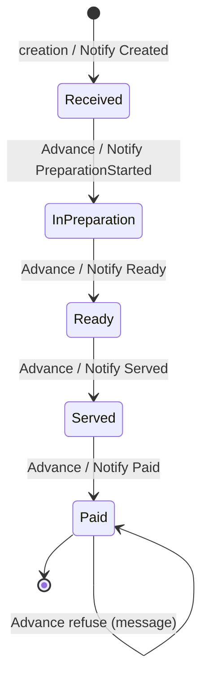
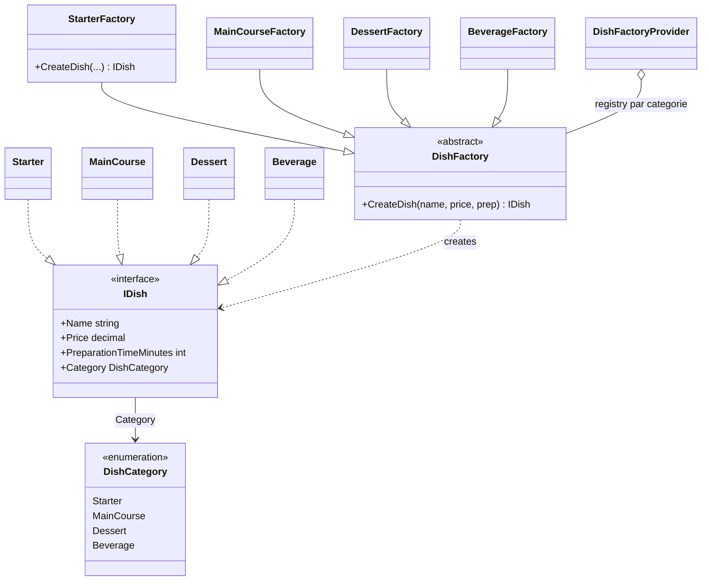
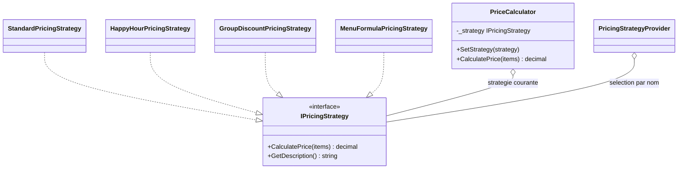
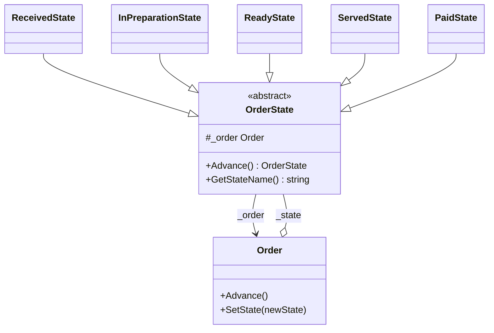
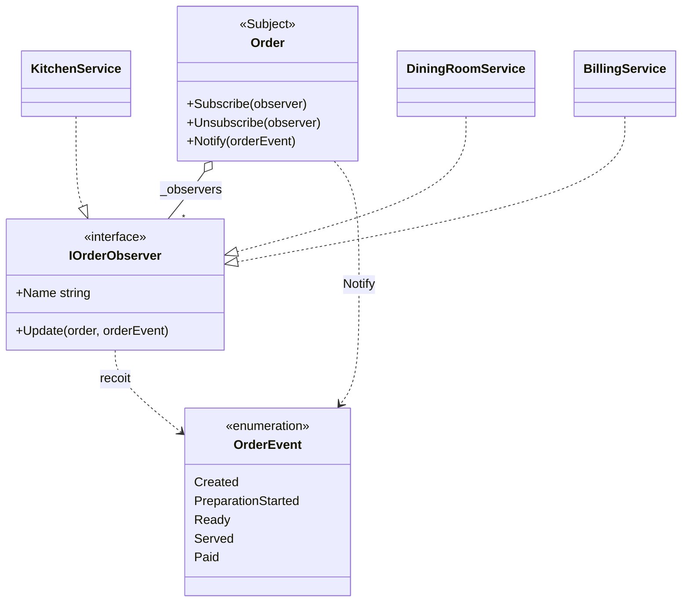
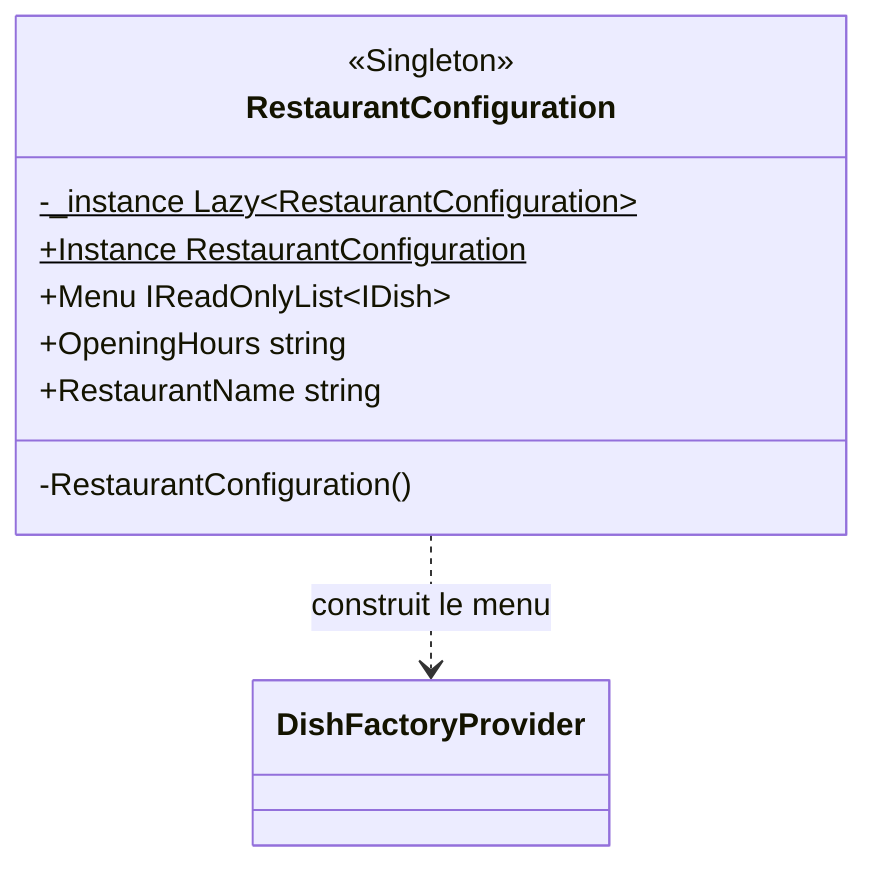
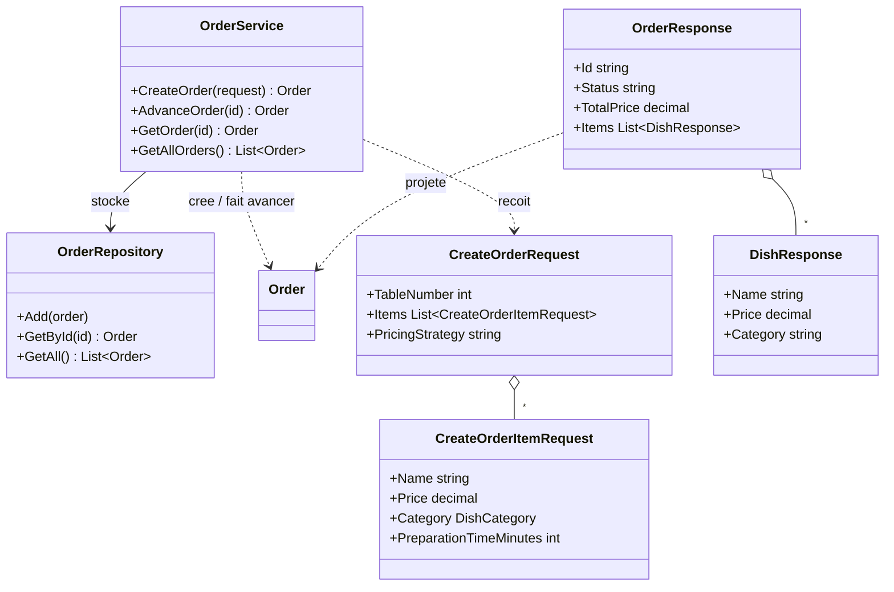

# API Restaurant - Design Patterns

> Projet individuel - **Khettab Driss** - ESGI Lyon

API REST de gestion des commandes d'un restaurant. Le projet part d'un squelette donné
et le restructure autour de 5 design patterns, un par besoin metier.

## Patterns utilises

| Besoin | Probleme | Pattern | Dossier |
|--------|----------|---------|---------|
| 1. Types de plats | Creer 4 categories de plats sans eparpiller la logique | **Factory Method** | `Dishes/`, `Factories/` |
| 2. Prix flexible | 4 politiques de prix interchangeables, sans if/else | **Strategy** | `Pricing/` |
| 3. Workflow commande | Cycle de vie Recue -> ... -> Payee, sans switch geant | **State** | `States/` |
| 4. Notifications | Prevenir plusieurs services decouples | **Observer** | `Observers/` |
| 5. Config globale | Menu et parametres partages, instance unique | **Singleton** | `Configuration/` |

## Diagramme UML

Diagrammes ecrits en Mermaid : ils se rendent directement sur GitHub. Pour un rendu
image (PNG/SVG) a joindre au rendu, colle le code dans https://mermaid.live puis exporte.

**Lecture** : le diagramme global est une vue d'ensemble (une classe par role de pattern).
Les zooms qui suivent detaillent chaque pattern avec **toutes ses classes concretes et
toutes ses relations**. Ensemble, global + zooms + couche application couvrent la
**totalite des classes du projet** (patterns, enums, stockage et DTOs).

### Diagramme de classes global

Le stereotype `<<...>>` de chaque classe indique son role dans le pattern
(Product/Creator, Strategy/Context, State, Observer/Subject, Singleton).



### Diagramme d'etats de la commande (pattern State)



### Zoom par pattern

<details>
<summary>Factory Method (Besoin 1)</summary>


</details>

<details>
<summary>Strategy (Besoin 2)</summary>


</details>

<details>
<summary>State (Besoin 3)</summary>


</details>

<details>
<summary>Observer (Besoin 4)</summary>


</details>

<details>
<summary>Singleton (Besoin 5)</summary>


</details>

<details>
<summary>Couche application (orchestration, stockage, DTOs)</summary>


</details>

## Demarrage

### Prerequis
- .NET SDK (8 ou plus recent ; le projet cible net8.0 mais `RollForward=LatestMajor`
  permet de le lancer sur un runtime plus recent, ex: .NET 10).

### Lancer l'API
```bash
cd RestaurantApi/RestaurantApi
dotnet run
```
La console affiche l'URL d'ecoute (par defaut `http://localhost:5205`).
Swagger est disponible sur `http://localhost:5205/swagger`.

Les notifications des services (Observer) et les transitions d'etat (State)
s'affichent dans la **console** pendant l'utilisation.

## Endpoints

| Methode | Route | Description |
|---------|-------|-------------|
| GET | `/` | Verifie que l'API tourne |
| GET | `/api/menu` | Menu complet (Singleton) |
| GET | `/api/orders` | Liste toutes les commandes |
| GET | `/api/orders/{id}` | Une commande (404 si absente) |
| POST | `/api/orders` | Cree une commande avec calcul de prix |
| PUT | `/api/orders/{id}/state` | Fait avancer la commande d'une etape |

## Exemples de requetes

### Creer une commande (POST /api/orders)
Le champ `pricingStrategy` est optionnel (defaut `Standard`). Valeurs possibles :
`Standard`, `HappyHour`, `GroupDiscount`, `MenuFormula`.

```json
{
  "tableNumber": 5,
  "pricingStrategy": "MenuFormula",
  "items": [
    { "name": "Caesar Salad",   "price": 8.50,  "category": "Starter",    "preparationTimeMinutes": 10 },
    { "name": "Grilled Salmon", "price": 18.00, "category": "MainCourse", "preparationTimeMinutes": 25 },
    { "name": "Chocolate Cake", "price": 6.50,  "category": "Dessert",    "preparationTimeMinutes": 5 }
  ]
}
```
Reponse `201 Created` : la commande avec son `id`, `totalPrice` calcule (ici 25 euros
grace a la formule menu) et `status` initial `Received`.

### Faire progresser une commande (PUT /api/orders/{id}/state)
Chaque appel avance d'une etape :
`Received -> InPreparation -> Ready -> Served -> Paid`.
Une commande `Paid` ne bouge plus (message en console, pas d'erreur).

## Architecture

### Besoin 1 - Factory Method (types de plats)
- Produit : interface `IDish` (`Dishes/IDish.cs`), implementee par `Starter`,
  `MainCourse`, `Dessert`, `Beverage`.
- Creator : classe abstraite `DishFactory` avec `CreateDish(...)`, une factory
  concrete par categorie.
- `DishFactoryProvider` centralise le choix de la factory selon la categorie.

Pourquoi : la creation d'un plat est centralisee et le code appelant ne connait que
`IDish`. Ajouter une categorie = 1 produit + 1 factory + 1 ligne dans le provider,
sans toucher au reste (Open/Closed).

### Besoin 2 - Strategy (calcul du prix)
- Contrat : `IPricingStrategy.CalculatePrice(items)`.
- 4 strategies : `Standard`, `HappyHour` (-20% entre 15h et 19h),
  `GroupDiscount` (-15% au dessus de 50 euros), `MenuFormula` (prix fixe 25 euros
  pour entree + plat + dessert).
- Contexte : `PriceCalculator` delegue le calcul a la strategie courante.
- `PricingStrategyProvider` selectionne la strategie selon le nom recu dans la requete.

Pourquoi : la classe `Order` ne contient aucun algorithme de calcul, aucun if/else de
choix de politique, et on ajoute une nouvelle politique en creant une seule classe.

> Note : `HappyHour` depend de l'heure reelle. Hors du creneau 15h-19h elle renvoie
> le prix plein (conforme a l'enonce).

### Besoin 3 - State (workflow de la commande)
- Base : classe abstraite `OrderState` (champ `protected _order`, `Advance()`, `GetStateName()`).
- Etats concrets : `ReceivedState`, `InPreparationState`, `ReadyState`, `ServedState`, `PaidState`.
- Approche 2 : chaque etat **retourne** le prochain etat, et le contexte `Order`
  applique la transition (`SetState` journalise `X -> Y`).
- `PaidState` est final : il affiche un message et ne transite plus.

Pourquoi : plus aucun `switch`/`if` sur des chaines de statut. Chaque etape est une
classe avec son comportement, et les transitions sont explicites et controlees.

### Besoin 4 - Observer (notifications inter-services)
- Sujet : `Order` tient une liste de `IOrderObserver` (`Subscribe`/`Unsubscribe`/`Notify`).
- Observers : `KitchenService`, `DiningRoomService`, `BillingService`, chacun reagit
  aux evenements qui le concernent (`OrderEvent`).
- Les notifications sont declenchees par les transitions d'etat (lien State + Observer)
  et a la creation.

Pourquoi : `Order` ne connait que l'abstraction `IOrderObserver`, jamais les services
concrets. On ajoute un service en creant une classe et en l'abonnant, sans modifier `Order`.

### Besoin 5 - Singleton (configuration globale)
- `RestaurantConfiguration` : constructeur prive + `static Lazy<RestaurantConfiguration>`.
- `Lazy<T>` garantit une instance unique, initialisee une seule fois et thread-safe.
- Contient le menu (construit via les factories du besoin 1) et les parametres du restaurant.

Pourquoi : un seul point d'acces global aux donnees partagees, sans risque de doublon
d'instance.

### Orchestration
`OrderService` assemble les patterns lors d'une creation : il utilise les factories
pour construire les plats, le `PriceCalculator` + la strategie pour le prix, abonne
les services observateurs, puis notifie l'evenement `Created`. Les reponses HTTP
passent par des DTO (`Dtos/`) pour ne pas serialiser les references internes de `Order`
(etat courant, observers).

## Structure

```
RestaurantApi/
├── Program.cs                 Endpoints + injection de dependances
├── Configuration/            Singleton (config + menu)
├── Dishes/                   Factory : produits (IDish + plats concrets)
├── Factories/                Factory : creators + provider
├── Pricing/                  Strategy : politiques de prix + contexte
├── States/                   State : etats du workflow
├── Observers/                Observer : services notifies
├── Services/                 OrderService (orchestration)
├── Dtos/                     Objets de requete/reponse
├── Models/                   Order (contexte State + sujet Observer), DishCategory
└── Repositories/             OrderRepository (stockage in-memory, fourni)
```
